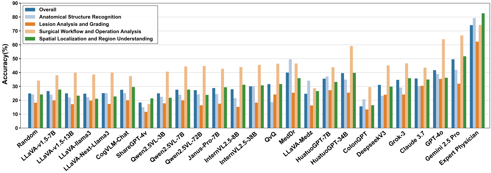

# **EndoBench**: A Comprehensive Evaluation of Multi-Modal Large Language Models for Endoscopy Analysis (NeurIPS’25 D&B)

<p align="center">
  
</p>

<!-- <i>The avatar is generated by DALLE-3.</i> -->

[🤖 **Homepage**](https://cuhk-aim-group.github.io/EndoBench.github.io/) | [**🤗 Dataset**](https://huggingface.co/datasets/Saint-lsy/EndoBench) | [**📖 Paper**](https://arxiv.org/abs/2505.23601)

[Shengyuan Liu](https://scholar.google.com/citations?user=zP6fRqcAAAAJ&hl=en)<sup>1*</sup> [Boyun Zheng](https://scholar.google.com/citations?user=ZveKOXkAAAAJ&hl=zh-CN)<sup>1*</sup> [Wenting Chen](https://o0t1ng0o.github.io/)<sup>2*</sup> [Zhihao Peng](https://zhihaopeng-cityu.github.io/ZhihaoPENG_homepage/)<sup>1</sup> [Zhenfei Yin](https://yinzhenfei.github.io/)<sup>3</sup> [Jing Shao](https://amandajshao.github.io/)<sup>4</sup> Jiancong Hu<sup>5</sup> [Yixuan Yuan](https://www.ee.cuhk.edu.hk/~yxyuan/people/people.htm)<sup>1✉</sup>


<sup>1</sup>Chinese University of Hong Kong &emsp; <sup>2</sup>City University of Hong Kong &emsp; <sup>3</sup>University of Oxford &emsp; 

<sup>4</sup>Shanghai AI Laboratory &emsp; <sup>5</sup>The Sixth Affiliated Hospital, Sun Yat-sen University &emsp;

<sup>\*</sup> Equal Contributions. <sup>✉</sup> Corresponding Author. 

This repository is the official implementation of the paper **EndoBench: A Comprehensive Evaluation of Multi-Modal Large Language Models for Endoscopy Analysis**.

## ✨ News
- [01/03/2026] We release the **EndoVQA-Instruct** Dataset at [here](https://huggingface.co/datasets/Saint-lsy/EndoVQA-Instruct).
- [21/10/2025] We release a new open-set challenging VQA benchmark, [EndoBench-extended](https://huggingface.co/datasets/Saint-lsy/EndoBench-Extended).
- [19/09/2025] 🎉🎉Our EndoBench was accepted by NeurIPS'25 D&B Track!!!
- [29/05/2025] The manuscript can be found on [arXiv](https://arxiv.org/abs/2505.23601).

## 🚀Overview

In this paper, we introduce **EndoBench**, the first comprehensive benchmark specifically designed to assess MLLMs across the full spectrum of endoscopic practice with multi-dimensional capacities. 

**EndoBench** encompasses *4* distinct endoscopic scenarios, *12* specialized clinical tasks with *12* secondary subtasks, and *5* levels of visual prompting granularities, resulting in **6,832** rigorously validated VQA pairs from **21** diverse datasets. 

**EndoBench** establishes a new standard for evaluating and advancing MLLMs in endoscopy, highlighting both progress and persistent gaps between current models and expert clinical reasoning.
 


## 🏥 EndoBench-Extended
The [EndoBench-extended](https://huggingface.co/datasets/Saint-lsy/EndoBench-Extended) dataset is the extended version of Endobench, which includes 48 images and 91 open-set VQA pairs, carefully selected by medical experts to ensure clinical relevance and diagnostic difficulty.  The EndoBench-extended specifically focuses on challenging and underrepresented cases, including rare pathologies, overlapping lesions, atypical anatomical presentations, and post-surgical endoscopic views.

## 📦Evaluation

We provide a comprehensive evaluation of the following MLLMs on **EndoBench**:

1. This project is built upon **VLMEvalKit**. To get started:

Visit the [VLMEvalKit Quickstart Guide](https://github.com/open-compass/VLMEvalKit/blob/main/docs/en/Quickstart.md) for installation instructions. or you can run the following command for a quick start:
```bash
git clone https://github.com/CUHK-AIM-Group/EndoBench.git
cd EndoBench
pip install -e .
```

2. You can evaluate your model with the following command:
```bash
python run.py --data EndoBench --model Your_model_name 
```
**Demo**: Qwen2.5-VL-7B-Instruct on EndoBench, Inference only
```bash
python run.py --data EndoBench --model Qwen2.5-VL-7B-Instruct --mode infer
```

We provide the Performance comparison across 4 major categories in EndoBench among existing MLLMs:

For More Details, please see our paper.
## 🔍 Insights
1. Endoscopy remains a challenging domain for MLLMs, with significant gaps between models and human expertise. Human experts achieve an average accuracy of 74.12\% in endoscopy tasks, while the top-performing model, Gemini-2.5-Pro, reaches only 49.53\%—a gap of roughly 25\%. 

2. Medical domain-specific Supervised Fine-Tuning markedly boosts model performance. Medical models that underwent domain-specific supervised fine-tuning, such as MedDr and HuatuoGPT-Vision-34B, perform exceptionally well in tasks like landmark identification and organ recognition, even outperforming all proprietary models.

3. Model performance varies with visual prompt formats, exposing a gap between visual perception and medical comprehension. The ability of models to understand spatial information varies significantly based on how visual prompts are formatted.


4. Polyp counting exposes dual challenges in lesion identification and numerical reasoning. Our findings highlight the importance of incorporating domain-specific medical knowledge into MLLMs to enhance their performance in tasks that combine visual analysis with clinical expertise.


## 🎈Acknowledgements
Greatly appreciate the tremendous effort for the following projects!
- [VLMEvalKit](https://github.com/open-compass/VLMEvalKit/tree/main)
- [GMAI-MMBench](https://uni-medical.github.io/GMAI-MMBench.github.io/)
- [IntelliScope](https://github.com/ai4colonoscopy/IntelliScope)
- [SurgicalVQA](https://github.com/lalithjets/Surgical_VQA)

**Note**: This dataset is built based on multiple public datasets. The sources of these datasets have been clearly indicated in the paper. Users should abide by the relevant licenses and terms of use of the original datasets: [Kvasir](https://datasets.simula.no/kvasir/), [HyperKvasir](https://datasets.simula.no/hyper-kvasir/), [Kvasir-Capsule](https://datasets.simula.no/kvasir-capsule/), [GastroVision](https://datasets.simula.no/gastrovision/), [KID](https://mdss.uth.gr/datasets/endoscopy/kid/), [WCEBleedGen](https://zenodo.org/records/7548320), [SEE-AI](https://www.kaggle.com/datasets/capsuleyolo/kyucapsule), [Kvasir-Seg](https://datasets.simula.no/kvasir-seg/), [CVC-ColonDB](https://www.kaggle.com/datasets/longvil/cvc-colondb), [ETIS-Larib](https://www.kaggle.com/datasets/nguyenvoquocduong/etis-laribpolypdb), [CVC-ClinicDB](https://www.kaggle.com/datasets/balraj98/cvcclinicdb), [CVC-300](https://www.kaggle.com/datasets/nourabentaher/cvc-300), [EDD2020](https://datasetninja.com/edd2020), [SUN-Database](http://amed8k.sundatabase.org/), [LDPolypVideo](https://github.com/dashishi/LDPolypVideo-Benchmark), [PolypGen](https://github.com/DebeshJha/PolypGen), [Cholec80](https://universe.roboflow.com/daad-mobility/cholec80), [EndoVis-17](https://github.com/duggalrahul/MICCAI17_EndoVis_RoboSeg), [EndoVis-18](https://opencas.dkfz.de/endovis/challenges/2018/), and [PSI-AVA](https://github.com/BCV-Uniandes/TAPIR).

Greatly appreciate all the authors of these datasets for their contributions to the field of endoscopy analysis.

## 📜Citation
If you find this work helpful for your project, please consider citing our paper.
```
@article{liu2025endobench,
  author={Shengyuan Liu and Boyun Zheng and Wenting Chen and Zhihao Peng and Zhenfei Yin and Jing Shao and Jiancong Hu and Yixuan Yuan},
  title={A Comprehensive Evaluation of Multi-Modal Large Language Models for Endoscopy Analysis},
  journal={arXiv preprint arXiv:2505.23601},
  year={2025}
}
```


